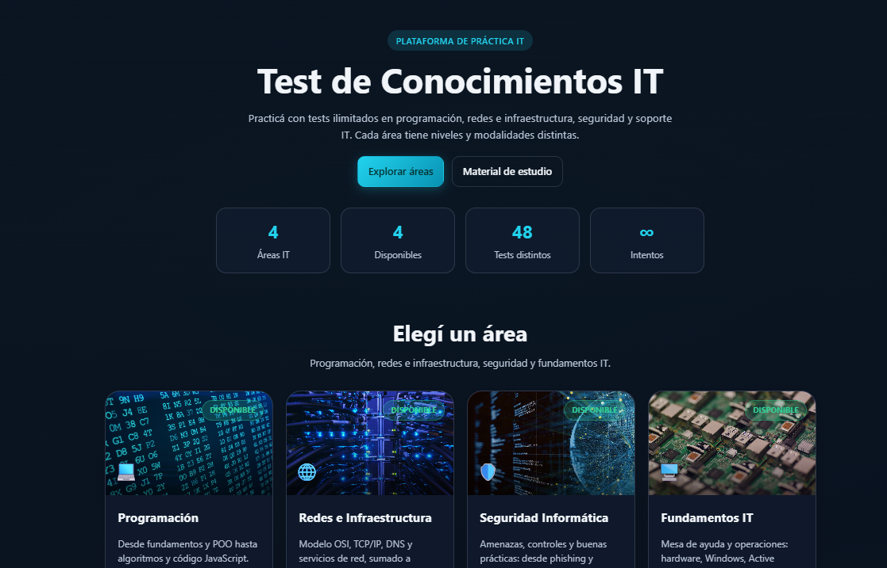
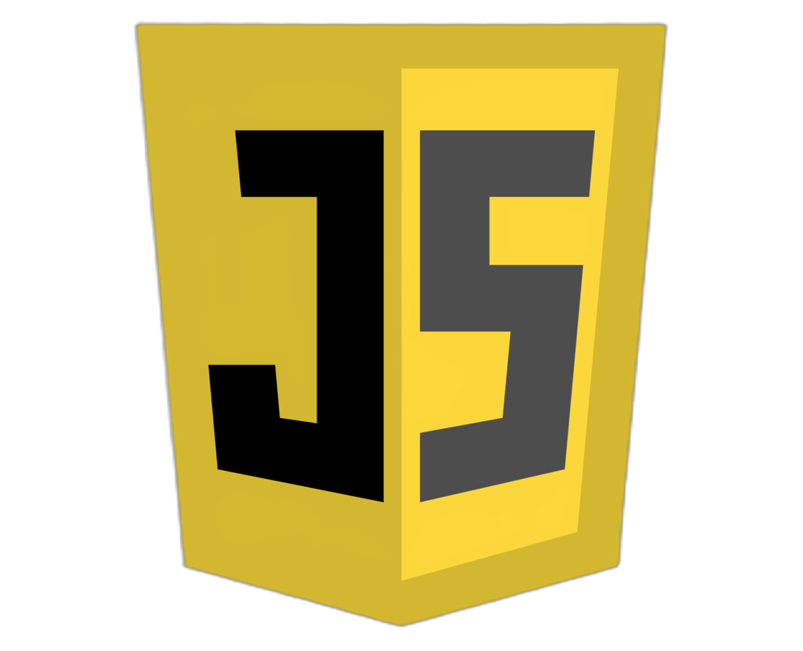
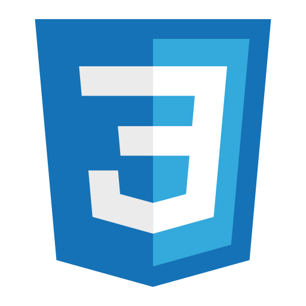

<div align="center">
  
</div>

<div align="right">
  
  
  
  
  
  
</div>

<br>

<div align="right">
  <a href="./README.es.md" target="_blank">
    
  </a>
  <a href="https://github.com/andresWeitzel/WebSite_Test_IT" target="_blank">
    
  </a>
</div>

<div align="center">

# IT Test — Plataforma de tests IT 

</div>

Plataforma web para **practicar y evaluar conocimientos IT** con tests ilimitados, múltiples modalidades por nivel, material de estudio integrado y seguimiento de puntajes en el navegador.

**Sitio en producción:** [it-tests.netlify.app](https://it-tests.netlify.app/)

<br>

## Índice 📜

<details>
  <summary> Ver detalle </summary>

<div align="right">

`Última actualización: 08/07/26`

</div>

### Sección 1) Descripción, configuración y tecnologías

* [1.0) Descripción.](#10-descripción-)
* [1.1) Ejecución del proyecto.](#11-ejecución-del-proyecto-)
* [1.2) Estructura del proyecto.](#12-estructura-del-proyecto-)
* [1.3) Tecnologías.](#13-tecnologías-)

### Sección 2) Flujo de uso y funcionamiento

* [2.0) Flujo de la plataforma.](#20-flujo-de-la-plataforma-)
* [2.1) Áreas, niveles y modalidades.](#21-áreas-niveles-y-modalidades-)
* [2.2) Almacenamiento de puntajes.](#22-almacenamiento-de-puntajes-)
* [2.3) Bancos de preguntas.](#23-bancos-de-preguntas-)

### Sección 3) Pruebas, deploy y referencias

* [3.0) Prueba funcional.](#30-prueba-funcional-)
* [3.1) Deploy en Netlify.](#31-deploy-en-netlify-)
* [3.2) Contribuir.](#32-contribuir-)
* [3.3) Licencia.](#33-licencia-)

<br>

</details>

<br>

## Sección 1) Descripción, configuración y tecnologías

### 1.0) Descripción [🔝](#índice-)

<details>
  <summary>Ver detalle</summary>

<br>

**IT Test** es una aplicación web estática (MPA con Vite) orientada a estudiantes y profesionales IT que quieren repasar y medir conocimientos de forma práctica. El proyecto cubre:

* **Home con áreas de test:** Programación, Redes e Infraestructura, Seguridad Informática y Fundamentos IT.

* **Motor de evaluación:** tests en modal a pantalla completa (móvil), barra de progreso, corrección al enviar y reintento.

* **Cuatro modalidades por nivel:** Rápido (10), Clásico (20), Extendido (30) y Lectura práctica (10 fragmentos de código o escenarios).

* **Material de estudio:** contenido por área con acordeones, sidebar de navegación y enlaces a tests.

* **Novedades:** calendario dinámico (FullCalendar) con hitos del proyecto, sugerencias de práctica y eventos por mes/día.

* **Seguimiento local:** intentos, mejor puntaje y último resultado guardados en `localStorage` del navegador.

**Requisitos:**

* Node.js 18 o superior.

* npm (incluido con Node).

<br>

</details>

### 1.1) Ejecución del proyecto [🔝](#índice-)

<details>
  <summary>Ver detalle</summary>

<br>

* Crear o abrir el entorno de trabajo y posicionarse en la raíz del repositorio:

```bash
cd WebSite_IT_Test
```

* Clonar el repositorio (si aún no lo tenés):

```bash
git clone https://github.com/andresWeitzel/WebSite_Test_IT.git
cd WebSite_Test_IT
```

* Instalar dependencias:

```bash
npm install
```

* Modo desarrollo (recarga en caliente):

```bash
npm run dev
```

La app queda disponible en `http://localhost:5173`.

* Build de producción:

```bash
npm run build
```

Genera la carpeta `dist/` lista para publicar.

* Vista previa del build:

```bash
npm run preview
```

* `Importante:` si algún paso falla por versiones de Node, verificá con `node -v` (18+) y reinstalá dependencias con `rm -rf node_modules && npm install`.

<br>

</details>

### 1.2) Estructura del proyecto [🔝](#índice-)

<details>
  <summary>Ver detalle</summary>

<br>

```
WebSite_IT_Test/
├── index.html                    # Home (entrada Vite)
├── html/                         # Páginas internas (MPA)
│   ├── testProgramacion.html
│   ├── testRedes.html
│   ├── testSeguridadInformatica.html
│   ├── testFundamentosIT.html
│   ├── testElectronica.html      # redirige a Fundamentos IT
│   ├── materialEstudio.html
│   └── novedades.html
├── public/
│   ├── critical.css              # CSS crítico inline en HTML
│   └── images/                   # Iconos, fondos y material
├── doc/
│   └── assets/
│       ├── home_readme.png       # Captura del home para documentación
│       ├── translation/          # Banderas y README en español
│       ├── icons/                # Iconos de stack y badges
│       └── social-networks/      # Iconos de redes (YouTube, etc.)
├── src/
│   ├── main.js                   # Entrada del home
│   ├── components/               # UI reutilizable
│   │   ├── navbar.js
│   │   ├── footer.js
│   │   ├── pageTabs.js
│   │   ├── hero.js
│   │   ├── areaCard.js
│   │   ├── roadmapSection.js
│   │   ├── topicsAccordion.js
│   │   ├── helpModal.js
│   │   └── modal.js
│   ├── data/
│   │   ├── areas.js              # Áreas, cursos, ruta de práctica
│   │   ├── site.js               # Rutas, navegación, textos globales
│   │   ├── calendarEvents.js     # Eventos del calendario de novedades
│   │   ├── variants.js           # Metadatos de modalidades
│   │   ├── studyMaterial/        # Contenido por área
│   │   └── questions/            # Bancos JSON + utilidades
│   ├── js/
│   │   ├── test/                 # Motor común de tests
│   │   ├── testProgramacion/
│   │   ├── testRedesInfra/
│   │   ├── testSeguridad/
│   │   ├── testFundamentosIT/
│   │   ├── material/
│   │   ├── novedades/
│   │   └── utilidades/
│   ├── layout/
│   │   └── mountLayout.js        # Navbar + tabs + footer en páginas internas
│   ├── pages/                    # Entradas por HTML (Vite)
│   └── styles/
│       ├── tokens.css
│       ├── layout.css
│       ├── main.css
│       ├── pages.css
│       ├── test.css
│       └── legacy-pages.css
├── vite.config.js
├── netlify.toml
└── package.json
```

<br>

</details>

### 1.3) Tecnologías [🔝](#índice-)

<details>
  <summary>Ver detalle</summary>

<br>

| **Tecnología** | **Versión** | **Propósito** |
| ------------- | ------------- | ------------- |
| [Vite](https://vitejs.dev/) | 6.x | Build, dev server y empaquetado MPA |
| JavaScript (ES modules) | ES2020+ | Lógica de la app sin framework frontend |
| CSS modular | — | Tokens, layout, páginas, tests y componentes |
| [FullCalendar](https://fullcalendar.io/) | 5.5 | Calendario de novedades (CDN) |
| [Netlify](https://www.netlify.com/) | — | Hosting estático de `dist/` |
| [Git](https://git-scm.com/) | 2.x | Control de versiones |
| localStorage | API nativa | Persistencia de intentos y puntajes |
| Playwright (dev) | 1.x | Dependencia disponible para pruebas E2E futuras |

<br>

</details>

<br>

## Sección 2) Flujo de uso y funcionamiento

### 2.0) Flujo de la plataforma [🔝](#índice-)

<details>
  <summary>Ver detalle</summary>

<br>

1. **Inicio:** el usuario elige un área desde el home o desde las pestañas de tests del navbar.

2. **Selección de nivel y modalidad:** en cada área hay tres niveles (Básico, Medio, Avanzado) con cuatro variantes cada uno.

3. **Test en modal:** se abre un modal con preguntas, progreso de respuestas y botón de envío.

4. **Corrección:** al enviar, se marcan aciertos/errores, se muestra el puntaje y se guarda en `localStorage`.

5. **Repaso:** el usuario puede reintentar, consultar material de estudio o seguir la ruta sugerida en Novedades.

<br>

</details>

### 2.1) Áreas, niveles y modalidades [🔝](#índice-)

<details>
  <summary>Ver detalle</summary>

<br>

| Área | Ruta | ID en storage |
|------|------|----------------|
| Programación | `/html/testProgramacion.html` | `programacion` |
| Redes e Infraestructura | `/html/testRedes.html` | `redes-infra` |
| Seguridad Informática | `/html/testSeguridadInformatica.html` | `seguridad` |
| Fundamentos IT | `/html/testFundamentosIT.html` | `fundamentos-it` |

**Modalidades por nivel:**

| Modalidad | Preguntas | Descripción breve |
|-----------|-----------|---------------------|
| Rápido | 10 | Repaso express del nivel |
| Clásico | 20 | Evaluación estándar |
| Extendido | 30 | Recorrido amplio del nivel |
| Lectura práctica | 10 | Fragmentos de código o escenarios reales |

Cada área incluye además la sección **Temas por nivel** (acordeón con bloques de contenido) y enlaces al material de estudio.

<br>

</details>

### 2.2) Almacenamiento de puntajes [🔝](#índice-)

<details>
  <summary>Ver detalle</summary>

<br>

Los resultados se guardan en el navegador con el prefijo `testit_`:

```
testit_{areaId}_{nivel-modalidad}_{attempts|best|last}
```

Ejemplo:

```
testit_programacion_basico-rapido_attempts
testit_programacion_basico-rapido_best
testit_programacion_basico-rapido_last
```

* **attempts:** cantidad de intentos (también alterna el set de preguntas teóricas).

* **best:** mejor porcentaje obtenido.

* **last:** JSON con último resultado (correctas, total, porcentaje, fecha).

<br>

</details>

### 2.3) Bancos de preguntas [🔝](#índice-)

<details>
  <summary>Ver detalle</summary>

<br>

* **Programación (teoría):** módulos en `src/js/testProgramacion/preguntasTest*.js` (6 sets × 5 preguntas por nivel).

* **Otras áreas (teoría):** `teoriaBanks.js` por área (~30 preguntas por área).

* **Lectura práctica:** JSON en `src/data/questions/{area}/practica.json` o `programacion/*.codigo.json`.

Formato canónico (ver `src/data/questions/normalize.js`):

```json
{
  "id": "prog-bas-cod-01",
  "type": "code",
  "question": "¿Qué imprime este código?",
  "options": { "a": "...", "b": "...", "c": "..." },
  "answer": "b",
  "code": "...",
  "language": "JavaScript",
  "tags": ["variables"]
}
```

<br>

</details>

<br>

## Sección 3) Pruebas, deploy y referencias

### 3.0) Prueba funcional [🔝](#índice-)

<details>
  <summary>Ver detalle</summary>

<br>

#### 3.0.1) Verificar que la app corre en local

```bash
npm run dev
```

Abrí `http://localhost:5173` y comprobá:

* Home con las 4 tarjetas de área.
* Navbar: Inicio, Novedades, Material, Ayuda.
* Pestañas de tests por área (desktop) o menú hamburguesa (móvil).

#### 3.0.2) Caso 1 — Completar un test rápido

1. Entrá a **Programación** → nivel **Básico** → modalidad **Rápido**.
2. Respondé las 10 preguntas y tocá **Enviar**.
3. Verificá puntaje, corrección visual y botón **Reintentar**.
4. En DevTools → Application → Local Storage, buscá claves `testit_programacion_…`.

#### 3.0.3) Caso 2 — Material de estudio

1. Abrí `/html/materialEstudio.html`.
2. Navegá por áreas en el sidebar (o tabs en móvil).
3. Expandí un tema y usá el enlace a la sección de tests del área.

#### 3.0.4) Caso 3 — Novedades y calendario

1. Abrí `/html/novedades.html`.
2. Revisá el calendario mensual y tocá un evento para ver el detalle.
3. Consultá la ruta de práctica embebida debajo del calendario.

#### 3.0.5) Build de producción

```bash
npm run build
npm run preview
```

Confirmá que todas las rutas (`/`, `/html/testRedes.html`, etc.) cargan sin errores en consola.

<br>

</details>

### 3.1) Deploy en Netlify [🔝](#índice-)

<details>
  <summary>Ver detalle</summary>

<br>

El archivo `netlify.toml` define:

```toml
[build]
  command = "npm run build"
  publish = "dist"
```

**Deploy manual:**

1. Conectá el repo en Netlify.
2. Build command: `npm run build`.
3. Publish directory: `dist`.

**Sitio publicado:** [it-tests.netlify.app](https://it-tests.netlify.app/)

<br>

</details>

### 3.2) Contribuir [🔝](#índice-)

<details>
  <summary>Ver detalle</summary>

<br>

1. Hacé fork del proyecto.

2. Creá una rama (`git checkout -b feature/mi-mejora`).

3. Commit de tus cambios (`git commit -m 'feat: descripción breve'`).

4. Push a la rama (`git push origin feature/mi-mejora`).

5. Abrí un Pull Request.

Si encontrás un error en una pregunta o en el contenido de estudio, también podés abrir un **Issue** con el área, nivel y texto de la pregunta.

<br>

</details>

### 3.3) Licencia [🔝](#índice-)

<details>
  <summary>Ver detalle</summary>

<br>

Proyecto open source. Desarrollado por [Andrés Weitzel](https://github.com/andresWeitzel).

**Enlaces relacionados:**

* **Repositorio:** [github.com/andresWeitzel/WebSite_Test_IT](https://github.com/andresWeitzel/WebSite_Test_IT)
* **Material de estudio (repo):** [github.com/andresWeitzel/Material_de_Estudio](https://github.com/andresWeitzel/Material_de_Estudio)
* **Canal YouTube:** [youtube.com/@andresWeitzel](https://www.youtube.com/channel/UCuSVXmBcMURyTvbmbcgZalQ/featured)

<br>

</details>
